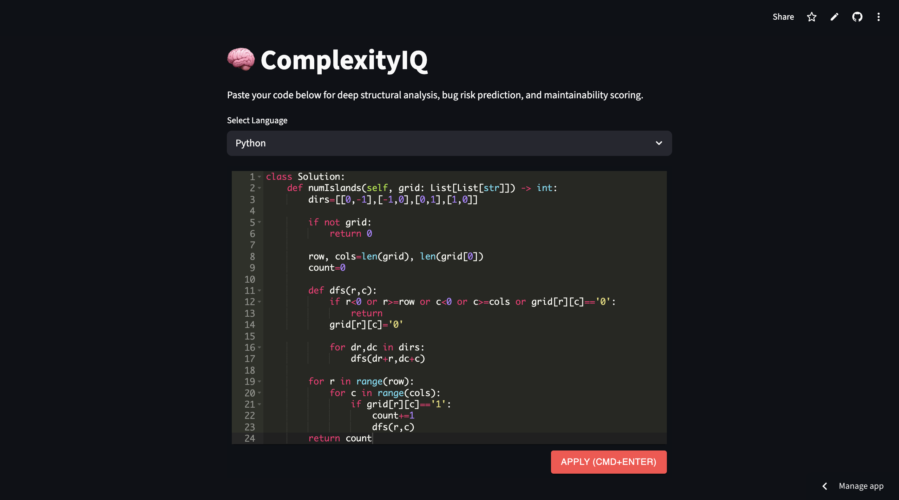
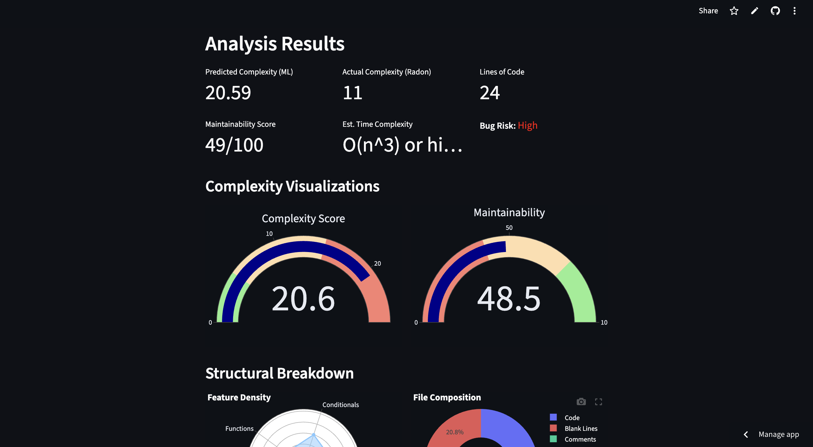
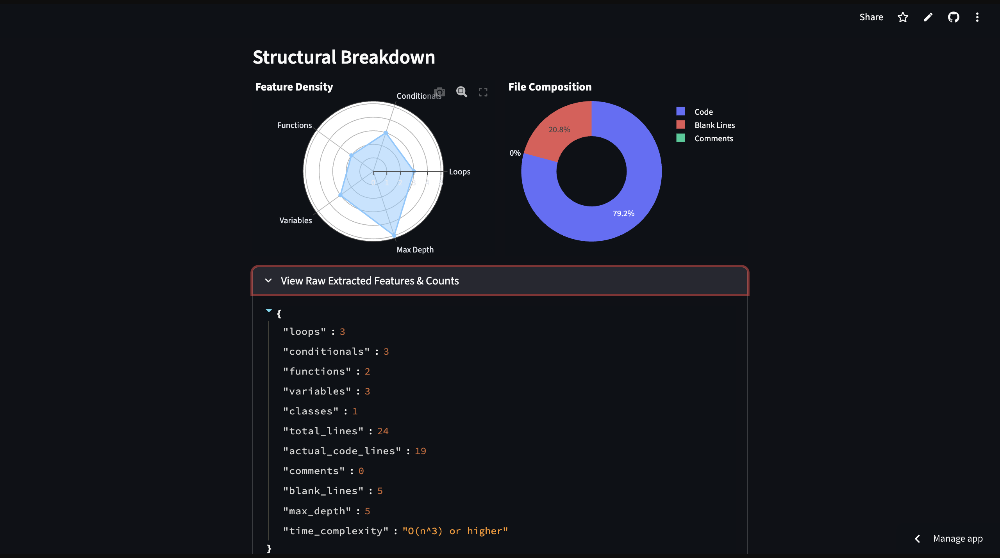

# complexityIQ 🧠⚡

An intelligent, ML-powered code analysis platform built with Streamlit that helps developers understand the structural complexity, maintainability, and potential bug risk of source code.

By combining heuristic-based feature extraction, static analysis techniques, and machine learning, ComplexityIQ provides deep insights into code quality through interactive visualizations and predictive analytics.

---

# 🌐 Live Demo

🔗 **Try the App Here:**  
https://complexityIQ.streamlit.app

---

# ✨ Features

## 🔍 ML-Powered Complexity Prediction
Predicts cyclomatic complexity using a trained `RandomForestRegressor` model built on synthetically generated datasets inspired by industry benchmarks such as PROMISE and Defects4J.

## 📊 Interactive Visual Analytics

Understand your code instantly with rich visualizations powered by Plotly:

- **Gauge Charts** → Real-time complexity & maintainability feedback
- **Radar Charts** → Structural density analysis
- **Donut Charts** → Distribution of code, comments, and blank lines

## 🧮 Maintainability Scoring

Generates a maintainability score (0–100) based on:
- Cyclomatic complexity
- Documentation density
- Structural code patterns

## 🐞 Bug Risk Estimation

Identifies potentially risky code patterns associated with:
- High complexity
- Excessive nesting
- Poor maintainability

## 🌐 Multi-Language Support

Supports analysis for:
- Python
- Java
- C++
- JavaScript

## ⚙️ Static Code Analysis

Integrates with `radon` for precise Python cyclomatic complexity analysis.

## 📝 Embedded Code Editor

Uses `streamlit-ace` for a smooth in-browser coding and testing experience.

---

# 🖼️ Screenshots

## Dashboard Overview


## Complexity Analysis


---

# 🛠️ Tech Stack

| Category | Technology |
|---|---|
| Framework | Streamlit |
| Machine Learning | scikit-learn |
| Visualization | Plotly |
| Static Analysis | radon |
| Code Editor | streamlit-ace |
| Data Processing | pandas, numpy |

---

# 🧠 Machine Learning Pipeline

The project uses a machine learning pipeline consisting of:

- `StandardScaler`
- `RandomForestRegressor`

### Model Configuration

- **Estimators:** 100
- **Max Depth:** 10
- **Training Samples:** 5,000 synthetic records

The synthetic dataset simulates real-world coding patterns to provide intelligent complexity estimation without relying on external datasets or APIs.

---

# 📂 Project Structure

```plaintext
ComplexityIQ/
│
├── app/
│   └── main.py                 # Streamlit entry point & UI logic
│
├── models/
│   └── model_pipeline.py       # Synthetic data generation & ML training
│
├── src/
│   ├── extraction.py           # Feature extraction logic
│   └── visualization.py        # Plotly visual components
│
├── screenshots/                # Project screenshots
│
├── requirements.txt
└── README.md
```

---

# ⚙️ Installation

## Prerequisites

- Python 3.9+
- pip

---

## Clone the Repository

```bash
git clone https://github.com/your-username/complexityiq.git

cd complexityiq
```

---

## Install Dependencies

```bash
pip install -r requirements.txt
```

---

## Run the Application

```bash
streamlit run app/main.py
```

---

# 🚀 How It Works

1. User submits source code
2. Feature extraction identifies:
   - Loops
   - Conditionals
   - Functions
   - Nesting depth
   - Documentation density
3. Static analysis calculates complexity metrics
4. ML model predicts overall complexity
5. Visualization engine renders interactive analytics

---

# 📈 Metrics Generated

The analyzer computes:

- Cyclomatic Complexity
- Maintainability Index
- Comment Density
- Function Density
- Structural Risk Indicators
- Bug Risk Estimation

---

# 🎯 Use Cases

- Code quality assessment
- Technical interview projects
- Software engineering research
- Educational demonstrations
- Maintainability analysis
- Developer productivity tools

---

# 🔮 Future Improvements

- AST-based deep parsing
- Real-world dataset training
- GitHub repository integration
- CI/CD pipeline integration
- AI-generated optimization suggestions
- Support for more programming languages

---

# 🤝 Contributing

Contributions are welcome.

If you'd like to improve the project:

1. Fork the repository
2. Create a feature branch
3. Commit your changes
4. Submit a pull request

---

# 📜 License

This project is licensed under the MIT License.

---

# 👨‍💻 Developed By

**Priyesh Kumar Thakur**

Built for intelligent structural analysis, maintainability prediction, and smarter software engineering workflows.
